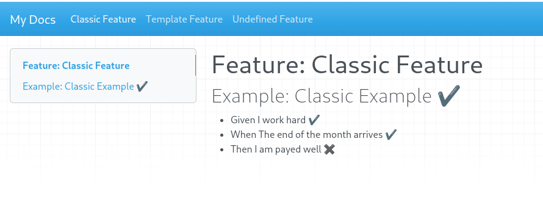

# Mkdocs Gherkin Results Plugin

This plugin parses and injects the results of a Cucumber test report back into your Mkdocs pages.

This allows to create a living documentation where your Cucumber scenarios are written in Gherkin format (see link bellow).

It works by parsing the Cucumber messages, generated during the tests, and injecting the results in the Markdown before it is parsed as HTML, using the **on_page_markdown** hook.


## Features

- Whenever a test case has passed, a checkmark will be added next to it.

  

- If a test case has failed a cross will be added.

- Screenshot attachments

  

## Examples

Check the configuration example under tests/test_docs.

It configures both cucumber-js and mkdocs in the same directory.

To run the example, you need to:

* Run the cucumber tests

  * cd tests/test-docs
  * npm i
  * npm run test

* Run the mkdocs documentation

  * Create and activate your python venv, using your preferred method
  * Run the documentation generator 

    `python tests/test-docs/run.py`


## Installing

In your mkdocs.yaml add the following:
```yaml
plugins:
- gherkin-plugin
```

## Configuration

- **show_attachments** - Boolean value that controls if the file attachements are shown in the final result. Defaults to True

- **messages_path** - Location where to load the cucumber messages ndjson. Defaults to "gherkin_messages.ndjson"

Example:
```yaml
plugins:
  show_attachments: True
  messages_path: "gherkin_messages.ndjson"
```

### Dependencies
If you use screenshots attachments, you will need to add the following markdown dependencies as well:


```yaml
markdown_extensions:
  - admonition
  - pymdownx.details
  - pymdownx.superfences
```

## TODO

- [ ] Fix pending steps not shown
- [ ] Add a short video explaining how it all works

## References

- https://github.com/cucumber/gherkin/blob/main/MARKDOWN_WITH_GHERKIN.md

- https://github.com/cucumber/messages

- https://cucumber.io/blog/podcast/living-documentation/

- https://www.mkdocs.org/dev-guide/plugins/
